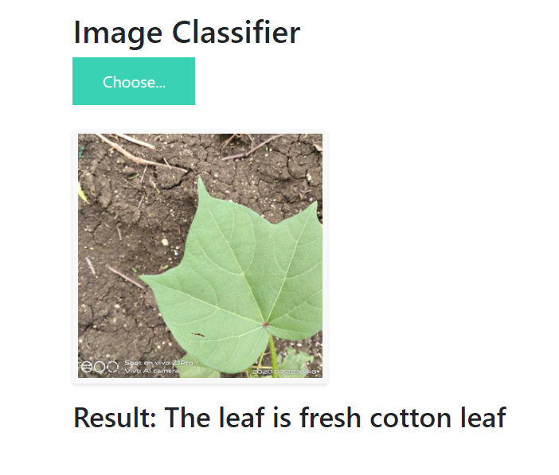
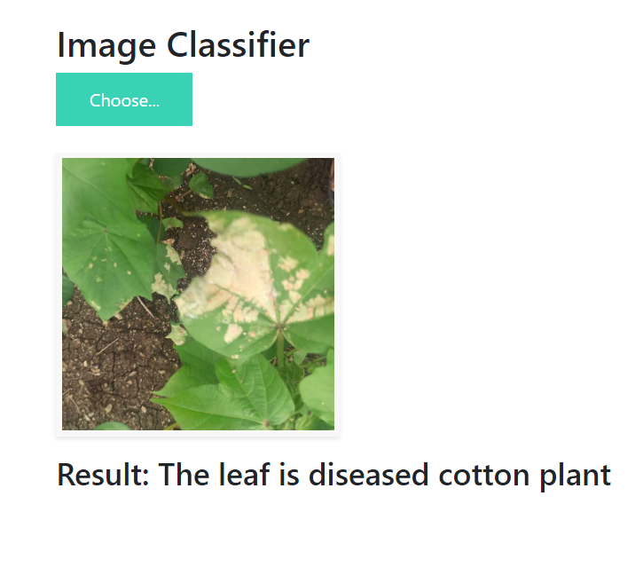

# Cotton Disease Prediction Project With Deep Learning(Overview)

## Website UI

* Created a tool using transfer learning that recognize fresh and diseased cotton leaves with 95% accuracy after running 20 epochs.

* Optimized Inception V3, and Resnet 50 to reach the best model.

* Built a client facing UI using JavaScript, HTML and CSS.

* Built a client facing API using flask.

* Uploaded this project on Cloud using Heroku.

**Technology and tools wise this project covers:**
1. Python
2. Numpy and Pandas for data cleaning
3. Matplotlib for data visualization
4. Kers 
5. Inception V3, and Resnet 50 for Model building
6. Jupyter notebook, Visual Studio Code and Spyder as IDE
7. Flask
8. JavaScript, HTML and CSS for UI building
9. Heroku for Cloud Deployment

## Sources

**Dataset:** https://drive.google.com/drive/folders/1vdr9CC9ChYVW2iXp6PlfyMOGD-4Um1ue

**You can view on the details of this project here:** https://www.youtube.com/user/krishnaik06
